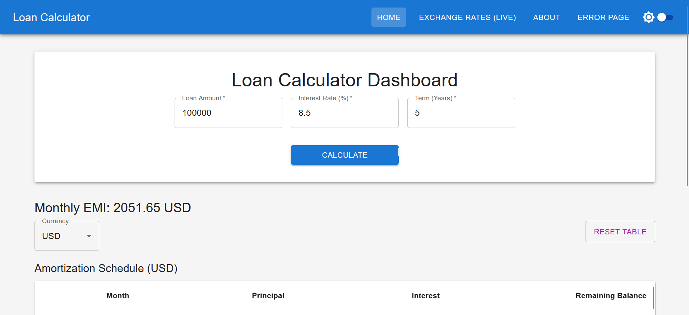

# Loan Calculator App

## 🔗 Live Demo

[Loan Calculator App](https://loan-calculator-app-git-main-thewarriormonkks-projects.vercel.app/)



## 📄 About This App

This Loan Calculator App is a modern, single-page web application built using React JS and Material UI. It allows users to calculate loan EMIs (Equated Monthly Installments), view a detailed amortization schedule, and see real-time currency conversions of their EMI using live exchange rates. It features a clean, responsive design with both light and dark mode options.

## 🚀 Features

- **Loan EMI Calculation:** Calculates the Equated Monthly Installment using standard financial formulas.
- **Amortization Schedule:** Displays a dynamic table with a monthly breakdown of principal, interest, and remaining balance.
- **Real-time Currency Conversion:** Converts the calculated EMI to other currencies using live exchange rates from the ExchangeRate-API.
- **Paginated Exchange Rates:** Shows a paginated table of live exchange rates for over 160 currencies.
- **Dark/Light Mode:** Offers a toggle for a customizable viewing experience.
- **Responsive Design:** Fully functional and looks great on all screen sizes, built with Material UI.
- **Collapsible Mobile Navigation:** Provides a user-friendly navigation on smaller screens.
- **Error Handling:** Includes graceful handling of runtime errors and a 404 Not Found page.

## 🧱 Technologies Used

- **React JS:** A JavaScript library for building user interfaces (using Hooks, Routing, and Context API).
- **Material UI:** A React UI framework implementing Google's Material Design.
- **TypeScript:** A superset of JavaScript that adds static typing.
- **Axios:** A promise-based HTTP client for making API calls.
- **Exchange Rate API:** For fetching real-time currency exchange rates.
- **react-virtuoso:** For efficiently rendering large tables.

## 🧮 EMI Formula

The EMI (Equated Monthly Installment) is calculated using the formula:
EMI = [P × R × (1+R)^N] / [(1+R)^N − 1]

Where:

- `P` = Principal loan amount
- `R` = Monthly interest rate (annual rate / 12 / 100)
- `N` = Loan duration in months

## 🛠️ Setup Instructions

Follow these steps to get the Loan Calculator App running on your local machine:

1.  **Clone the repository:**

    ```bash
    git clone https://github.com/thewarriormonkk/loan-calculator.git
    cd loan-calculator
    ```

2.  **Install dependencies:**

    ```bash
    npm install
    # or
    yarn install
    ```

3.  **Set up the environment variables:**
    Create a `.env` file in the root of your project and add your Exchange Rate API key:

    ```
    VITE_API_URL=[https://v6.exchangerate-api.com/v6/YOUR_API_KEY/latest/USD](https://v6.exchangerate-api.com/v6/YOUR_API_KEY/latest/USD)
    ```

    _(Replace `YOUR_API_KEY` with your actual API key from [ExchangeRate-API](https://www.exchangerate-api.com/))_

4.  **Run the development server:**
    ```bash
    npm run dev
    # or
    yarn dev
    ```
    This will start the application on a local development server (usually `http://localhost:5173`).

## 📂 Folder Structure

loan-calculator/
├── src/
│ ├── components/
│ │ ├── About.tsx
│ │ ├── EMITable.tsx
│ │ ├── Error.tsx
│ │ ├── ExchangeRates.tsx
│ │ ├── Form.tsx
│ │ ├── Home.tsx
│ │ └── Navbar.tsx
│ ├── context/
│ │ ├── CurrencyContext.tsx
│ │ └── ThemeContext.tsx
│ ├── hooks/
│ │ └── useFetchExchangeRates.ts
│ ├── types/
│ │ └── type.ts
│ ├── App.tsx
│ ├── main.tsx
│ └── ... other files
├── .env
├── package.json
├── README.md
├── tsconfig.json
├── vite.config.ts
└── ... other root files
